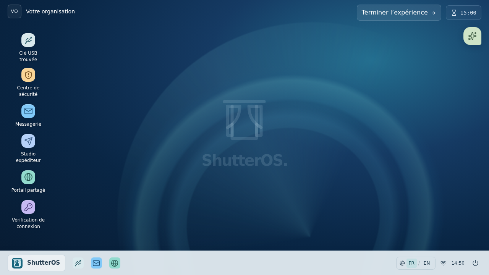

# shutteros-playground

**ShutterOS Playground — an independent cybersecurity awareness game for European Cybersecurity Month**

ShutterOS is a French/English cybersecurity-awareness game for a shared kiosk. A fictional desktop presents six short situations: an unknown USB drive, a suspected incident, an urgent email, sender spoofing, a look-alike web login, and an unexpected sign-in confirmation request.

Sessions last five to fifteen minutes. Players explore freely or choose a guided ending designed for three to five minutes. One configurable session clock resets the game after fifteen minutes by default.

It is a local simulation. It has no backend, account system, persistence, telemetry, CDN, or real authentication. The fictional login phrases, messages, addresses, files, and forms are game content. No input is sent to a service or retained after the current session.



The login begins with a single sticky note. The assistant stays collapsed until requested; the desktop offers free exploration, calm mode by default, all six situations, three quiet routines, and the recap.

The interface uses familiar desktop conventions with an original window-and-curtains identity. Each simulated application keeps its own visual vocabulary; guidance and answers live in a separate, expandable panel. A restrained palette, readable surfaces and progressive explanations support discovery at the player's pace. Organisation branding occupies its own space, independently of the fictional OS.

## Run and build

Use Node.js 22.13 or later (Node 24 is used in CI). Dependency installation and CI use pnpm 11.19.0 with the committed lockfile:

```sh
pnpm install --frozen-lockfile
pnpm dev
```

The development server listens on port 5173. To create both distributable variants:

```sh
pnpm build
```

The build produces the prerendered static site in `dist/` and the optional standalone artifact at `dist/portable/shutteros.html`. For kiosk use, serve `dist/` with Python's local HTTP server; `pnpm preview` is for development verification.

For everyday development, you can also run the scripts with **Bun** after the locked installation above:

```sh
bun run dev
bun run build
bun run check
```

Bun runs the package scripts, which use Node-based tools. Use `bun run test` for Vitest and `bun run check` for TypeScript and Svelte diagnostics. `bun test` selects Bun's own test runner. The full `verify` command orchestrates its steps with pnpm. Dependency changes and clean installations use pnpm so contributors and CI share one lockfile; `bun install` and forcing the Bun runtime with `--bun` are outside the supported workflow.

## Configuration and kiosk use

The regular static build loads `kiosk-config.json` at runtime and is the recommended local HTTP path. The portable artifact embeds `static/kiosk-config.json` at build time. Calm mode is optional and removes only challenge deadlines when enabled. `Ctrl+Alt+Home` returns to the simulated login screen.

Read the [player and facilitator guide](docs/user-guide.md) and [kiosk deployment](docs/kiosk.md) before deploying. The host's Cage/Chromium policy, not this page, handles operating-system kiosk lockdown and recovery.

The OS identity and the deploying organisation's name, campaign, and logo are separate. See [organisation branding](docs/branding.md) to personalise a deployment without committing organisation assets.

## Documentation

[Architecture](docs/overview.md) describes the static runtime and boundaries. [Content notes](docs/content.md) covers the educational claims and official references. Contribution and security guidance are in [CONTRIBUTING.md](CONTRIBUTING.md) and [SECURITY.md](SECURITY.md).

Storybook is available for component development with `pnpm storybook`; its static output is `storybook-static` (`pnpm build:storybook`).

## Validation

```sh
pnpm exec playwright install chromium --only-shell
pnpm verify
pnpm build:storybook
```

`verify` runs lint, formatting, types, Knip (unused files, dependencies and exports), unit tests, build, and browser checks. Run `pnpm knip` or `bun run knip` separately for the unused-code check. The [verification guide](docs/verification.md) describes coverage and deployment checks. CI also rebuilds and tests the GitHub Pages path. Publishing is opt-in and requires a successful verification on `main`; follow the [deployment guide](docs/publishing.md).

Dependabot checks version updates monthly, grouped into development tools, application dependencies, and GitHub Actions. Version-update PRs are limited to two for npm and one for Actions at a time. Security alerts and security-update PRs follow [GitHub's separate security settings](https://docs.github.com/en/code-security/how-tos/secure-your-supply-chain/secure-your-dependencies/configure-security-updates), not this monthly version schedule.

## License

Created by **F. Cabouat** ([fcabouat](https://github.com/fcabouat)).

The project source is MIT licensed; see [LICENSE](LICENSE). Redistributed dependencies retain their own licenses; see the [full dependency notices](static/THIRD-PARTY-NOTICES.txt). Each successful build includes `dist/LICENSE` and `dist/THIRD-PARTY-NOTICES.txt`; the portable edition includes the same notices. They are also available from **Start → About ShutterOS**.

This is an independent personal project created for awareness activities during European Cybersecurity Month. It is not affiliated with, endorsed by, or an official product of the campaign, ENISA, the European Commission, or Cybermalveillance.gouv.fr. Names, logos and other third-party identifiers remain the property of their respective rights holders; the MIT license grants no rights to them. No campaign or institutional logo is bundled. See [legal and attribution notes](docs/legal.md).
